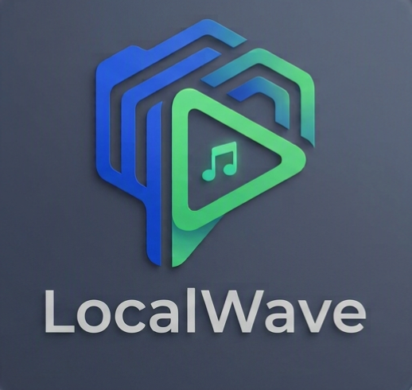

# LocalWave

A local-first, Spotify-style desktop music player. It scans a folder of audio files, builds a browsable library, and plays everything offline — with optional online enrichment for lyrics, artist images, and looping Canvas videos.

This is a Tauri 2 desktop app: a **React + Vite** frontend talking to an embedded **Rust + axum** backend over plain HTTP. There is no separate Node server in production; the Rust binary serves the built frontend inside the webview.



## Table of contents

- [Features](#features)
- [Tech stack](#tech-stack)
- [Prerequisites](#prerequisites)
- [Installation](#installation)
- [Build commands](#build-commands)
- [Development workflow](#development-workflow)
- [Architecture overview](#architecture-overview)
- [Configuration](#configuration)
- [Project structure](#project-structure)
- [Data and storage](#data-and-storage)
- [API surface](#api-surface)
- [Troubleshooting](#troubleshooting)
- [License](#license)

## Features

- **Local library playback** — scans MP3, FLAC, WAV, M4A from any folder.
- **Library views** — Home, Search, Library, Liked Songs, Album, Artist, Playlist.
- **Playlists** — create, rename, reorder, and import `.m3u` / `.m3u8` playlists.
- **Metadata editor** — edit title, artist, album, year, track number, and embedded cover art.
- **File watcher** — detects new, changed, or removed files after the initial scan.
- **Audio bridge** — HTML5 `<audio>` playback with gapless queue, shuffle, repeat modes, volume, and seeking.
- **Optional enrichment**
  - Lyrics via LRCLIB, Spotify internals, and Musixmatch (synced when available).
  - Spotify Canvas — short looping background videos for tracks.
  - Artist images sourced from Spotify.
- **Dark-only Spotify-inspired UI** built with Tailwind CSS.

## Tech stack

| Layer | Tools |
|-------|-------|
| Frontend | React 18, react-router 6, Zustand 5, TypeScript 5.7, Tailwind CSS 3.4, Vite 5 |
| Desktop shell | Tauri 2, Rust 1.77+ |
| Backend | tokio, axum 0.7, rusqlite (with bundled SQLite), r2d2 connection pool |
| Metadata | `lofty` for audio tags, `walkdir` for filesystem traversal, `notify` for file watching |
| Enrichment | Spotify internal API (`sp_dc` cookie + TOTP refresh), Musixmatch, LRCLIB |

## Prerequisites

- **Node.js** 18+ and `npm`
- **Rust** 1.77+ with `cargo`
- **Tauri system dependencies**
  - **Windows**: WebView2 runtime + Microsoft Visual C++ build tools
  - **macOS**: Xcode command-line tools
  - **Linux**: see [Tauri Linux prerequisites](https://tauri.app/start/prerequisites/)

## Installation

```bash
# Clone the repo
git clone <repository-url>
cd localwave-rs

# Install frontend dependencies
npm install

# (First Rust build will download and compile many crates; this takes a few minutes.)
```

## Build commands

### Frontend only

```bash
# Vite dev server on http://localhost:1420
# Note: this runs the UI without the Rust backend; API calls will fail.
npm run dev

# Production frontend build -> dist/
npm run build

# Type-check the TypeScript project
npm run typecheck
```

### Full desktop app

```bash
# Development: starts the Rust backend, Vite dev server, and the Tauri webview
npm run tauri dev

# Production bundle: builds the frontend and packages a Windows installer
npm run tauri build
```

The production build produces:

- `.nsis` installer
- `.msi` installer
- bundled app binaries under `src-tauri/target/release/bundle/`

### Rust verification

```bash
# Fast compile check (recommended before committing Rust changes)
cargo check --manifest-path src-tauri/Cargo.toml

# Full release build
cargo build --manifest-path src-tauri/Cargo.toml --release
```

## Development workflow

1. **Make frontend changes** in `src/`.
2. **Run `npm run typecheck`** before declaring frontend work done.
3. **To test the full app**, use `npm run tauri dev`. This is the only command that runs the backend (`:8787`) and the webview together.
4. **Make backend changes** in `src-tauri/src/` and verify with `cargo check --manifest-path src-tauri/Cargo.toml`.

Important: `npm run dev` only starts the Vite server. The frontend will not be able to call the backend because the Rust HTTP server is not running.

## Architecture overview

```
┌─────────────────────────────────────┐
│  Tauri webview (tauri://localhost)  │
│  React 18 + Vite frontend           │
└──────────────┬──────────────────────┘
               │ fetch to
               │ http://localhost:8787/api/*
               ▼
┌─────────────────────────────────────┐
│  Embedded Rust backend (axum)       │
│  • SQLite library DB                  │
│  • File scanner + watcher             │
│  • Audio streaming / cover art        │
│  • Spotify / Musixmatch enrichment    │
└─────────────────────────────────────┘
```

- **No separate server** — the same Rust binary that runs Tauri also hosts the axum API.
- **Boot order** (`src-tauri/src/main.rs`):
  1. Create `%APPDATA%/LocalWave` data directory
  2. Load `config.json`
  3. Initialize the SQLite pool and run migrations
  4. Start Spotify auth refresh in the background
  5. Bind axum server on `127.0.0.1:8787`
  6. Run initial library scan, then start file watcher
  7. Hand off to Tauri event loop
- **Frontend talks to backend via `fetch`**, not Tauri IPC. CORS is enabled on the Rust server so the Vite dev origin (`:1420`) and the webview origin both work.
- **Port coupling** — the embedded API is hard-coded to `localhost:8787` in `src/lib/api.ts`, `src-tauri/src/config.rs`, and `tauri.conf.json` CSP. Changing it requires updating all three places.

## Configuration

Configuration is stored in `%APPDATA%/LocalWave/config.json` and can be edited from **Settings** in the app.

| Key | Description | Default |
|-----|-------------|---------|
| `musicFolder` | Folder to scan for audio files | User's Music folder or `C:\Users\Public\Music` |
| `supportedExtensions` | Audio extensions to scan | `.mp3`, `.flac`, `.wav`, `.m4a` |
| `port` | Embedded axum API port | `8787` |
| `sp_dc` | Spotify `sp_dc` cookie for enrichment | empty |
| `enableLyrics` | Enable lyrics fetching | `true` |
| `enableCanvas` | Enable Spotify Canvas videos | `false` |
| `musixmatchAccessToken` | Musixmatch access token | empty |

> The app also supports standard Tauri logging. Set `RUST_LOG=info,localwave=debug` when running `npm run tauri dev` for verbose backend output.

## Project structure

```
localwave-rs/
├── src/                       # React frontend
│   ├── App.tsx                # Root app shell + routes
│   ├── main.tsx               # Entry point
│   ├── components/              # UI components
│   ├── pages/                   # Route-level pages
│   ├── store/                   # Zustand stores (library, player, ui)
│   ├── hooks/                   # usePlayer bridge + useLibrary helpers
│   ├── lib/                     # API client + formatting utilities
│   ├── types.ts                 # TypeScript type definitions
│   └── index.css                # Tailwind entry + global styles
├── src-tauri/                 # Rust + Tauri backend
│   ├── src/
│   │   ├── main.rs              # Application startup
│   │   ├── lib.rs               # Library crate root
│   │   ├── routes.rs            # axum route handlers
│   │   ├── db.rs                # SQLite pool + migrations
│   │   ├── config.rs            # Data dir + config.json
│   │   ├── scanner.rs           # Library scanner
│   │   ├── watcher.rs           # File watcher
│   │   ├── metadata.rs          # Audio tag reader/writer
│   │   ├── spotify_auth.rs       # Spotify auth refresh
│   │   ├── lyrics.rs            # Lyrics aggregation
│   │   ├── canvas.rs            # Spotify Canvas fetcher
│   │   ├── artist_image.rs      # Artist image fetcher
│   │   └── types.rs             # Rust data types
│   ├── Cargo.toml
│   └── tauri.conf.json
├── vite.config.ts             # Vite config (base: './', port 1420)
├── tailwind.config.ts         # LocalWave design tokens
└── tsconfig.json              # TypeScript paths + compiler options
```

## Data and storage

All runtime data is stored in the per-user directory `%APPDATA%/LocalWave/`, not in the repository:

- `localwave.db` — SQLite database in WAL mode with the library, playlists, likes, and play counts.
- `config.json` — runtime configuration.
- `config.json.broken` — backup created if the config file is corrupt.

The schema is migrated idempotently at every startup. When adding columns, follow the existing pattern in `src-tauri/src/db.rs` and guard with `column_exists` to keep migrations non-destructive.

### Player preferences

Volume, mute, shuffle, and repeat are persisted to browser `localStorage` under the key `localwave-player`. The current queue and playback position are deliberately **not** persisted.

## API surface

The frontend uses `src/lib/api.ts` to call the Rust backend. Key endpoints include:

```
GET  /api/library/tracks
GET  /api/library/search
GET  /api/library/albums
GET  /api/library/albums/:id
GET  /api/library/artists
GET  /api/library/artists/:id
GET  /api/library/artists/:id/tracks
GET  /api/library/liked
POST /api/library/liked/:trackId
POST /api/library/played/:trackId
GET  /api/library/tracks/:trackId/metadata
PATCH /api/library/tracks/:trackId/metadata

GET  /api/playlists
POST /api/playlists
GET  /api/playlists/:id
PATCH /api/playlists/:id
DELETE /api/playlists/:id
POST /api/playlists/:id/tracks
DELETE /api/playlists/:id/tracks/:trackId
POST /api/playlists/:id/reorder

GET  /api/stream/:trackId
GET  /api/cover/:trackId

GET  /api/scan/status
POST /api/scan/rescan

POST /api/imports/import

GET  /api/lyrics/:trackId
GET  /api/canvas/:trackId
GET  /api/artist-image/:artistId
GET  /api/features
```

## Troubleshooting

### Frontend can't reach the backend

Make sure you are running `npm run tauri dev` (full app) and not just `npm run dev` (frontend only). The axum server listens on `http://localhost:8787`.

### `npm run tauri dev` fails to compile

- Verify Rust 1.77+ is installed: `rustc --version`
- Install Tauri system dependencies (especially WebView2 on Windows / Xcode tools on macOS).
- The first build compiles many crates; expect several minutes.

### Audio won't play or queue behaves strangely

The audio bridge in `src/hooks/usePlayer.ts` is subtle. Do not refactor `pendingSeek`, the play-count dedup, or the StrictMode cleanup without reading the existing code carefully.

### New external network requests are blocked

If you add an external API or media origin, update `connect-src`, `media-src`, and/or `img-src` in `src-tauri/tauri.conf.json` CSP. Currently allowed origins include `localhost:8787`, `*.scdn.co`, `lrclib.net`, and `api.musixmatch.com`.

### Database migrations fail

Ensure the app has write access to `%APPDATA%/LocalWave/`. Migrations are idempotent, so a partial migration usually just requires a restart. Check the log output for the specific SQL error.

## License

MIT
